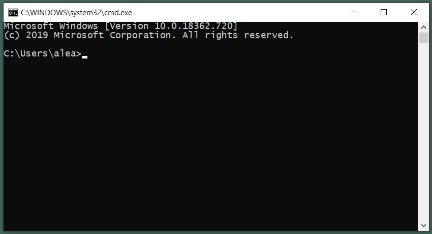
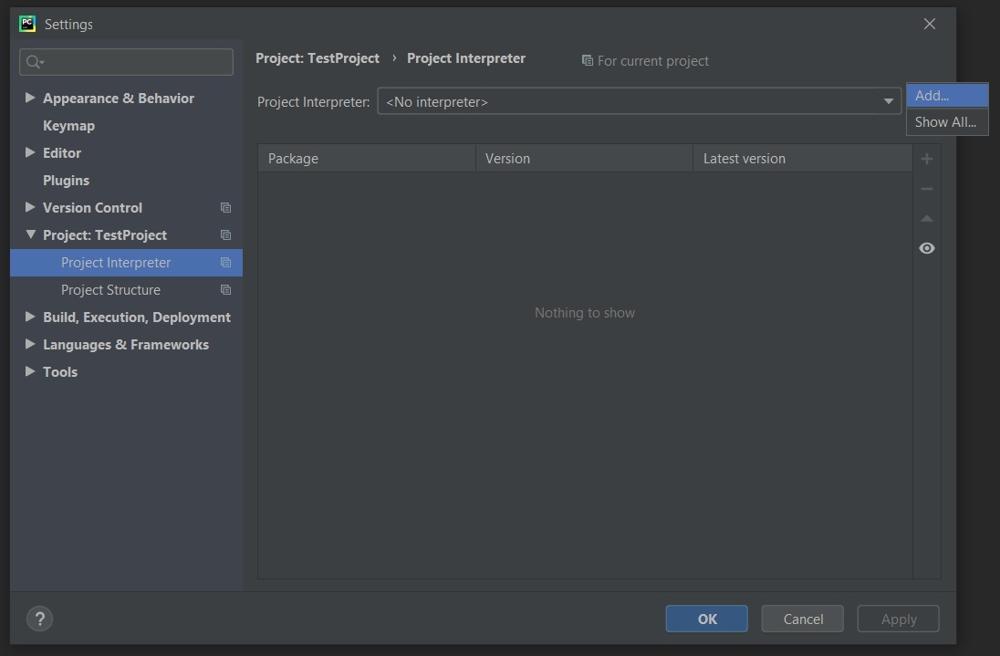
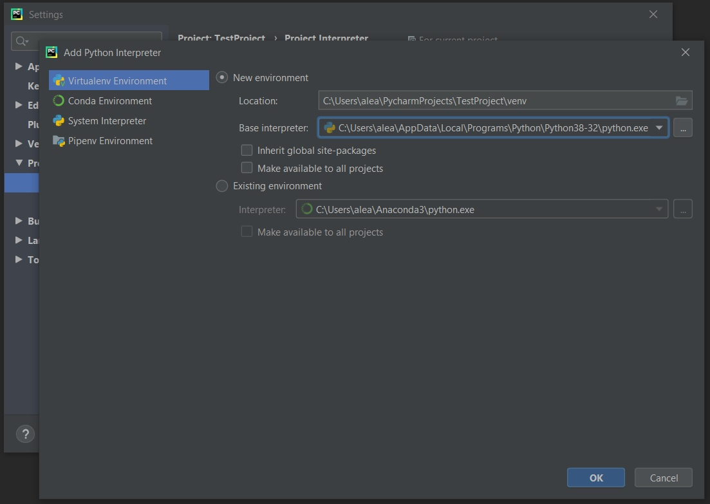
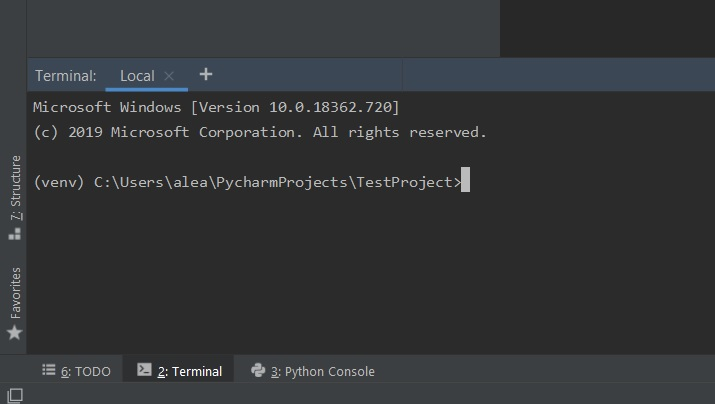

# Необходимые инструменты

Ниже еще раз описываю все необходимые нам инструменты. Постарался максимально подробно описать все, в чем вы возможно не уверены.

## Командная строка (терминал, консоль)

Это такая штуковина, которая выполняет команды, которые вы в неё вбиваете. Выглядит она, например, так:



В Windows есть две разных командных строки: **PowerShell** и **cmd**. Работа в них немного различается, но простейшие команды общие.

Основные команды:

|Действие                      |cmd             |PowerShell           |
|------------------------------|----------------|---------------------|
|Смена директории              |`cd NAME`       |`cd NAME`            |
|Список файлов                 |`dir NAME`      |`dir NAME` (или `ls`)|
|Удаление файла                |`del NAME`      |`rm NAME`            |
|Удаление директории           |`rmdir /s NAME` |`rm -r NAME`         |
|Установка переменной окружения|`set NAME=VALUE`|`$env:NAME="VALUE"`  |

Набор аналогичных команд для Mac OS/Ubuntu: `cd`, `ls`, `rm`, `rm -r`, `set NAME=VALUE`.

В командной строке можно выполнять различные команды (не зря же она так называется), в том числе запускать программы, такие как интерпретатор.

## Интерпретатор (Python interpreter)

Это программа, которая умеет исполнять питоновский код. Может принимать на вход имя файла с кодом, который надо выполнить, а может запускаться в интерактивном режиме — выполнение будет построчное.

Устанавливать интерпретатор рекомендуется с [официального сайта](https://www.python.org/downloads/).

Необходимо уметь вызывать интерпретатор вручную. У вас в системе скорее всего установлен не один, а может и не два разных интерпретатора. Вызов интерпретатора осуществляется через командную строку.

Когда вы набираете в командной строке `python`, она ищет, какой именно программе соответствует это "имя" `python`. По умолчанию она начинает искать в вашей текущей директории. Если там она ничего не находит с таким именем, она идет искать дальше. Где? Именно в тех директориях, которые находятся в специальной переменной окружения `PATH`.

Как посмотреть, что у вас в `PATH`:

* **cmd:** `PATH`
* **PowerShell:** `$env:PATH`
* **Mac OS/Ubuntu:** `echo $PATH`

Для того, чтобы ваш интерпрепатор запускался, вам необходимо, чтобы ссылка на его директорию была в PATH.

[Тут](https://helpdeskgeek.com/windows-10/add-windows-path-environment-variable/) про то, как добавить что-то в PATH на Windows.

[Тут](https://www.cyberciti.biz/faq/appleosx-bash-unix-change-set-path-environment-variable/) — тоже самое на Mac OS.

На размер `PATH` есть ограничения, но в современных версиях Windows их можно обойти [вот так](https://docs.python.org/3/using/windows.html#removing-the-max-path-limitation).

Запуск интерпретатора может производиться одной из команд: 

```
python
python3
py
```

В крайнем случае вы всегда можете запустить свой интерпретатор "напрямую", без сокращенной команды `python`, указав полный путь до него, например:

```
C:\Users\alea\AppData\Local\Programs\Python\Python38-32\python3
```

## Виртуальное окружение (Python virlual environment)

Чтобы не засорять систему, рекомендуется использовать для работы не исходное окружение установленного интерпретатора, а специально созданное. 

Окружение по факту представляет из себя папку с файлами — ссылками на различные модули и библиотеки. Поэтому чтобы удалить окружение достаточно просто удалить его папку.

При активации, окружение дает вам возможность обращаться только к версии Питона, с помощью которой он был создан (т.е. переписывает ваш локальный `PATH`), а так же устанавливать питоновские пакеты *только* в окружение.

Для создания окружения необходимо использовать стандартный модуль `venv`:

```
python -m venv NAME
```

где вместо `NAME` вы пишете желаемое имя окружения. Эта команда создаст папку с именем `NAME` — это и есть ваше окружение.

Для его активации необходимо использовать одну из следующих команд:

* **cmd:**
    ```
    NAME\Scripts\activate
    ```
* **PowerShell:**
    ```
    NAME\Scripts\Activate.ps1
    ```
* **Mac OS/Ubuntu:**
    ```
    source NAME/bin/activate
    ```

При активации окружения, в вашей командной строке появляется префикс с именем этого окружения.

Пример создания, активации, деактивации и удаления окружения

* PowerShell

```
PS C:\Users\alea\python> py -m venv my_env
PS C:\Users\alea\python> .\my_env\Scripts\Activate.ps1
(my_env) PS C:\Users\alea\python>
(my_env) PS C:\Users\alea\python> deactivate
PS C:\Users\alea\python> rm -r .\my_env\
PS C:\Users\alea\python>
```

* cmd

```
C:\Users\alea\python>py -m venv my_env
C:\Users\alea\python>my_env\Scripts\activate
(my_env) C:\Users\alea\python>
(my_env) C:\Users\alea\python>deactivate
C:\Users\alea\python>rmdir /s my_env
my_env, Are you sure (Y/N)? y

C:\Users\alea\python>
```

* MacOS/Ubuntu

```
~$ python3 -m venv my_env
~$ source my_env/bin/activate
(my_env) ~$
(my_env) ~$ deactivate
~$ rm -r my_env/
```

### Установка пакетов

После активации окружения, вы можете устанавливать пакеты с помощью `pip`:

```
pip install NAME
```

При деактивации и удалении этого окружения никаких следов об этом пакете не останется.

## Git

Git — это крайне полезный инструмент любого разработчика. Настоятельно рекомендую овладеть им. [Вот](https://product.hubspot.com/blog/git-and-github-tutorial-for-beginners) гайд для начинающий по Git-у и GitHub-у, другие обучающие материалы не стесняйтесь искать в интернете.

Git — это система управления версиями. Представьте, что вы храните файлы у себя в какой-то конкретной папке. Git — дает вам возможность отслеживать изменения в этих файлах с течением времени. Для этого необходимо после каждого вносимого изменения делать коммит — подтверждать созданные изменения и сохранять их в "дерево версий". Git хранит не сами файлы, а все их изменения от самого начала, до текущей версии. Эта самая папка — это ваш *локальный репозиторий*.

### Установка

Мы проделали её вместе на последнем семинаре. Скачать и установить Git можно от [сюда](https://git-scm.com/downloads).

После установки рекомендуется сделать примитивную конфигурацию, описанную [здесь](https://git-scm.com/book/en/v2/Getting-Started-First-Time-Git-Setup).

### Локальная работа

* Файл `.gitignore` (название должно быть именно таким, точка в начале обязательна!) позволяет вам указать, какие файлы не надо отслеживать. [Здесь](https://github.com/github/gitignore) полезный набор "стандартных" таких файлов.

* `git status` выводит текущий статус файлов в репозитории;

* `git add` добавляет файлы в будующий коммит;

* `git commit` подтверждает изменения во все указанные файлы.

#### Стандартный пайплайн работы с репозиторием

1. Работаем, меняем файлы, пишем код;
2. Добавляем нужные нам файлы с помощью `git add NAME` (можно добавлять целыми папками или вообще все через `git add .` в корне);
3. Делаем коммит с помощью `git commit -m "MESSAGE"`. В сообщении лучше кратко указывать, что вы сделали.

### Работа с удаленными репозиториями

Версия вашего репозитория может храниться не только у вас, но и на каком-то удаленном сервере, например на GitHub или на Heroku. Это позволяет вам синхронизироваться с другими пользователями и работать вместе над одним проектом.

Чтобы узнать, к каким удаленным серверам подключен ваш локальный репозиторий, используйте команду `git remote -v`.

Базовые команды

* `git clone` "скачивает" удаленный репозиторий к вам: то есть создает ваш локальный репозиторий, который привязан к удаленному, который вы "скачиваете";
* `git pull` скачивает изменения с удаленного репозитория в ваш и *мерджит* (сливает) версии удаленную и вашу. Здесь возможны конфликты, подробнее [тут](https://help.github.com/en/github/collaborating-with-issues-and-pull-requests/resolving-a-merge-conflict-using-the-command-line);
* `git push` загружает ваши изменения на удаленный сервер.

#### Стандартный пайплайн работы с удаленным репозиторием

При "первом знакомстве" с удаленным репозиторием нужно его склонировать командой `git clone ...`.

1. Скачиваем изменения `git pull`, устраняем все конфликты, закрепляем их локальным коммитом;
2. Работаем с файлами, пишем код;
3. Делаем локальный коммит, как описано выше;
4. Заливаем изменения на удаленный сервер `git push`.

## Редактор

Для написания кода мы пользуемся некоторым редактором. Это может быть любой редактор (даже блокнот), в котором можно набирать символы и редакторовать файлы. Однако удобнее, конечно, использовать специализированные редакторы кода. Вот список наиболее популярных:

* [VSCode](https://code.visualstudio.com/) *(выбор редакции)*
* [Sublime Text](https://www.sublimetext.com/)
* [Atom](https://atom.io/)

Они позволяют даже, используя различные расширения, превращать себя в полноценную IDE.

## PyCharm IDE

Многи из вас пользуются PyCharm-ом, что не так плохо. PyCharm — это так называемая IDE (Integrated Development Environment), окружение для разработки. Он включает в себя редактор кода, управления окружениями и другие инструменты разработчика.

Пользуясь PyCharm-ом, вы можете создавать окружение прямо из него, а так же использовать для запуска встроенную в него консоль или Run-скрипты.

### Создание проекта

Проект PyCharm-а — это просто папка с вашими файлами и папкой `.idea`, в которой храняться настройки PyCharma для этого проекта. Соответственно открывать проект можно как в специально отведенной для этого папке проектов (`C:\Users\alea\PycharmProjects`), так и в любой другой папке.

При создании вам предлагается определиться с интерпретатором — этот вопрос обсуждается чуть ниже.

### Создание окружения

Чтобы создать окружение из PyCharm-а, откройте настройки (`Ctrl+Alt+S`) и перейдите во вкладку `Project: NAME -> Project Interpreter`. Нажмите на "шестеренку" и выберите `Add...`.



Выберите здесь New environment и правильно укажите путь к желаемому интерпретатору. При желании можете поменять путь и имя папки `venv`, в которую надо создать окружение. Эта папка создается за вас, а если она уже существует, она должна быть пуста.



Нажмите ОК. Убедитесь, что теперь у вас выбран интерпретатор из только что созданного окружения и снова нажмите ОК.

Можете открыть командную строку, встроенную в PyCharm, и убедиться, что у вас активировалось созданное окружение:



### Запуск

Запуск кода можно по прежнему производить из любой командной строки. Встроенная в PyCharm командная строка — это cmd-консоль.

Вы можете так же запускать код с помощью Run-конфигураций PyCharm-а (об этом [тут](https://www.jetbrains.com/help/pycharm/running-code.html#)).


Подробнее про PyCharm можно почитать на их [сайте](https://www.jetbrains.com/pycharm/learning-center/).


---

Все вопросы можно задать в личку.
