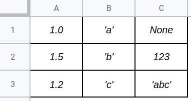

# Вариант В

Ваша задача: реализовать **таблицу**.

В файле вам дается шаблон с сигнатурами классов и всех методов, которые вам нужно реализовать. В функции `test()` приводятся примеры работы с классом. Ваш код должен как минимум соответствовать им (не выдавать `AssertionError` при запуске).

**Очень приветствуется** наличие документации к функциям, которые вы реализуете, которые описывают, что и как делает эта функция.

**Очень-очень приветствуется** правильное форматирование кода в соответствии с [codestyle](https://www.python.org/dev/peps/pep-0008/)-ом.

## Таблица



Таблица представляет из себя структуру данных, хранящую в себе набор строк и наименования их элементов. Её можно представить как массив из списков одинаковой длины. Каждый элемент в списке имеет некоторое название — имя столбца. Таким образом таблица — это матрица с именованными столбцами.

В примере выше таблица имеет три столбца (`A`, `B` и `C`) и три строки. Обращаю внимание, что в данной работе *не требуется* поддерживать один тип данных для элементов, расположенных в одном столбце.

## `class Table`

Вам необходимо реализовать данный класс (по сути "заполнить" функции). Ниже приводятся описания атрибутов, функций и их параметров.

### атрибут `rows`

Атрибут экземпляра класса. Представляет из себя список строк таблицы. При создании таблицы инициализируется пустым списком.

Строка таблицы представляется в виде списка.

### конструктор `__init__`

Параметры:

* `columns` — список имен столбцов таблицы.

### `__str__`

Краткое строковое представление таблицы. Метод должен возвращать строку в следующем формате:

```
<Table with *columns*>
```

где вместо `*columns*` список столбцов таблицы.

Пример:

```
>>> str(table)
<Table with ['A', 'B', 'C']>
```

*Подсказка:* используйте метод `format`.

### `__repr__`

Полное строковое представление всей таблицы. Метод должен возвращать всю таблицу в виде строки следующего формата: первая строка — через пробел все имена столбцов, следующие строки — через пробел все значения строк таблицы.

Пример:

```
>>> repr(table)
A B C
1 2 3
4 5 6
```

*Подсказка:* используйте метод `join`. Не забывайте про символ переноса строки `\n`.

### `__len__`

Возвращает количество строк в таблице.

### `__iter__`

Возвращает итератор следующего вида: при вызове `next` возвращается словарь, ключами которого являются имена столбцов, а значениями — соответствующие значения в очередной строке.

Пример:

```
>>> repr(table)
A B C
1 2 3
4 5 6
>>> next(table)
{'A': 1, 'B': 2, 'C': 3}
>>> next(table)
{'A': 4, 'B': 5, 'C': 6}
```

*Подсказка:* используйте оператор `yield` и dict comprehension.

### свойство `next_index`

Возвращает номер строки, который присвоится следующей добавленной строке. Т.е. если в данный момент в таблице 10 строк, то они имеют индексы 0, 1, ... 9, а значит свойство должно вернуть 10.

Пример:

```
>>> repr(table)
A B C
1 2 3
4 5 6
>>> table.next_index
3
```

### `validate`

Метод, который проверяет соответствие строки требованиям. Единственное требование здесь — соответствие размеров: длина строки должна совпадать с количеством столбцов в таблице.

В случае, если длина не совпадает, метод должен вызвать исключение `TableError`. Если совпадает — вернуть саму строку.

### `add_row`

Метод добавляет в таблицу строку. Строка перед добавлением должна валидироваться методом `validate`. Соответственно данный метод может вызвать ошибку. При успешном добавлении строки метод должен вернуть индекс добавленной строки.

### `get_row`

Метод возвращает строку с указанным индексом. В случае, если строки с таким индексом нет, возвращает `None`.

### `remove_row`

Метод удаляет из таблицы строку с указанным индексом. Если строки с таким индексом нет, ничего не происходит (никаких исключений не вызывается!).

## `class TableError`

Класс исключения, вызываемого таблицей в методе `validate`.

## Оценивание

Ваш класс будет протестирован на некотором наборе тестов. В зависимостии от количества пройденных тестов выставляется балл.

Балл может быть повышен или понижен из-за плохого codestyle-а или отсутствия хотя бы небольших комментариев.

Пишите красиво, ваш код будут читать :)
