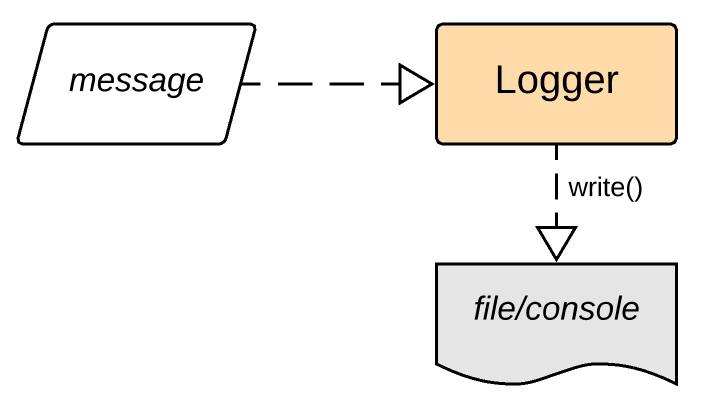

# Вариант С

Ваша задача: реализовать **логгер**.

В файле вам дается шаблон с сигнатурами классов и всех методов, которые вам нужно реализовать. В функции `test()` приводятся примеры работы с классом. Ваш код должен как минимум соответствовать им (не выдавать `AssertionError` при запуске).

**Очень приветствуется** наличие документаций к реализуемым функциям, которые описывают, *что* и *как* делает эта функция.

**Очень-очень приветствуется** правильное форматирование кода в соответствии с [codestyle](https://www.python.org/dev/peps/pep-0008/)-ом.

## Логгер

Логгер представляет из себя объект, отвечающий за сохранение требуемой информации в некоторый файл или поток. Чаще всего логгеры занимаются сохранением информации о произошедшем событии (event logging) или информации о состоянии (state logging).



В нашем случае логгер будет просто получать на вход сообщения и в определенном формате записывать их в файл/консоль.

Объект логгера должен существовать в единственном экземпляре, чтобы не возникало конфликтов записи. Для этого мы используем приватный классовый атрибут `_logger`, который будет хранить ссылку на существующий логгер. Создавать логгер мы будет не с помощью конструктора, а с помощью классового метода `get_logger`, который будет создавать логгер конструктором или возвращать ссылку на него, если таковой уже имеется в `_logger`.

## `class Logger`

### `_logger`

Атрибут класса. Хранит в себе ссылку на объект логгера, если такой существует. Изначально инициализируется `None`-ом. Когда первый раз будет вызван метод `get_logger`, этот объект должен быть создан и ссылка на него положена в `_logger`.

### `template`

Атрибут класса. Хранит в себе строку с шаблоном для сообщения. В эту строку будут форматироваться данные (само сообщение и время его отправки). В таком виде сообщения будут печататься.

### `__init__`

Принимает опциональный параметр `path` — строку с адресом файла, в который вести логгирование. Если `path` равен значению по умолчанию `None`, в таком случае считается, что вывод должен происходить в консоль (stdout).

*Подсказка:* Конструктор должен вызывать метод `set_output`.

### `stream`

Атрибут экземпляра класса. Хранит в себе ссылку на поток записи. В случае записи в файл, там хранится то, что возвращает метод `open()`. В случае записи в консоль там должен лежать `sys.stdout` (необходимо импортировать модуль `sys`).

### `set_output`

Метод принимает опциональный параметр `path` — строку с адресом файла, и устанавливает её в качестве нового output-файла логгера. 

Также обновляет атрибут `stream` в соответствии с новым значением output-файла.

Если файл с таким именем существует, логгер должен писать в его конец, а не перезаписывать файл.

Если `path` принимает значение по умолчанию `None`, что запись должна идти в косоль (`stream` должен указывать на stdout).

### `get_logger`

Классовый метод. Возвращает логгер, если он уже существует в `_logger`. Если нет, создает новый логгер с помощью конструктора, сохраняет ссылку на него в `_logger` и возвращает его.

### `__repr__`

Возвращает строковое представление логгера в формате:

```
<Logger *path*>
```

где вместо `*path*` стоит путь к файлу, в который ведется запись. Если запись ведется в консоль, там должно быть слово "stdout":

```
<Logger stdout>
```

### `time`

Статический метод. Возвращает строку, содержащую текущие дату и время.

Пример:

```
>>> logger.time()
2020-02-28 20:48:48.198280
```

*Подсказка:* используйте модуль `datetime`. В нем есть полезный метод `now` объекта `datetime`.

### `write`

Метод принимает на вход сообщение (строку). Подставляет его и текущее время в шаблон `template` и выводит результат. Вывод необходимо производить в поток, который хранится в `stream`.

Пример:
```
>>> logger.write('Hello, world!')
[2020-02-28 20:58:29.472356] Hello, world!
```

*Подсказка:* у функции `print` есть полезный аргумент `file`, который позволяет печатать в любой поток.

### `close`

Метод закрывает поток `stream` (вызывает метод `close`) в случае, если он был направлен в файл. После этого попытка записать в логгер будет вызывать ошибку. Для дальнейшего использования логгера необходимо будет заново установить вывод, т.е. вызвать `set_output`.

В случае, если вывод был направлен в консоль, метод ничего не делает, поток не закрывается (не надо закрывать stdout!).

## Оценивание

Ваш класс будет протестирован на некотором наборе тестов. В зависимостии от количества пройденных тестов выставляется балл.

Балл может быть повышен или понижен из-за плохого codestyle-а или отсутствия хотя бы небольших комментариев.

Пишите красиво, ваш код будут читать :)
