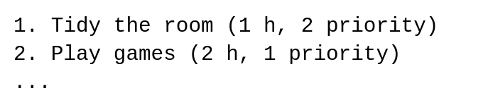

# Вариант D

Ваша задача: реализовать **расписание**.

В файле вам дается шаблон с сигнатурами классов и всех методов, которые вам нужно реализовать. В функции `test()` приводятся примеры работы с классом. Ваш код должен как минимум соответствовать им (не выдавать `AssertionError` при запуске).

**Очень приветствуется** наличие документации к функциям, которые вы реализуете, которые описывают, что и как делает эта функция.

**Очень-очень приветствуется** правильное форматирование кода в соответствии с [codestyle](https://www.python.org/dev/peps/pep-0008/)-ом.

## Расписание



Расписание представляет из себя список *заданий*. Каждое задание представляет из себя строку с описанием, а так же два числа: необходимое время и приоритет.

## `class Task`

Класс репрезентует одно задание.

### классовый атрибут `default_priority`

Это значение присваивается приоритету задания, если он не был указан явно. Мы возьмем его равным нулю.

### конструктор `__init__`

Инициализирует объект с переданными параметрами.

Параметры:

* `task` — строка с описанием задания,
* `time` — время в часах на его выполнение,
* `priority` — приоритет задания. По умолчанию ставится равным `default_priority`. Чем выше приоритет задания, тем раньше его нужно выполнить.

### `__str__`

Строковое представление задания. Представляет из себя строку самого задания и указание времени в скобках. Если у задания явно указан приоритет (т.е. он не равен `default_priority`), его так же следует указать в скобках.

Примеры:
```
>>> str(Task('Task A', 2))
Task A (2 h)
>>> str(Task('Task B', 3, 2))
Task B (3 h, 2 priority)
```

## `class Timetable`

Класс самого расписания. Хранит в себе задания в виде списка объектов `Task`.

### конструктор `__init__`

Инициализирует пустое расписание: список заданий пуст.

### `__len__`

Возвращает количество заданий в расписании.

### `__str__`

Возвращает краткое строковое представление расписания в формате:

```
<Timetable (*number* tasks)>
```

где вместо `*tasts*` стоит количество заданий в расписании.

Пример:

```
>>> str(timetable)
<Timetable (2 tasks)>
```

### `__repr__`

Возвращает полное строковое представление расписания в формате:

```
Timetable:
1. *Task 1*
2. *Task 2*
```

где вместо `*Task 1*`, `*Task 2*` стоят строковые представления заданий из расписания. Задания выводятся в том порядке, в котором они хранятся в расписании.

Пример:

```
>>> print(timetable)
Timetable:
1. Task A (2 h, 1 priority)
2. Task B (1 h)
```

*Подсказка:* используйте метод строки `join` и функцию `enumerate` в цикле, чтобы дать заданиям порядковые номера. Не забывайте про символ переноса строки `\n`.

### `__iter__`

Возвращает итератор по заданиям в порядке их хранения в расписании (т.е. в порядке их добавления).

### `add`

Добавляет в расписание задание. Возвращает его порядковый номер.

### `get`

Возвращает задание по его номеру. В случае если такого номера нет, возвращает `None`.

### `remove`

Удаляет задание из расписания по его номеру. В случае если такого номера нет, ничего не происходит.

### `arrange_by_priority`

Функция-генератор. Возвращает объекты заданий в порядке от наибольшего приоритета к наименьшему.

### `arrange_by_time`

Функция-генератор. Возвращает объекты заданий. Имеет параметр `desc`. Если `desc = True`, то задания возвращаются в порядке от наибольшего времени, к наименьшему. В противном случае — наоборот.

*Подсказка:* у встроенной функции `sorted` есть аргуент `reverse`.

## Оценивание

Ваш класс будет протестирован на некотором наборе тестов. В зависимостии от количества пройденных тестов выставляется балл.

Балл может быть повышен или понижен из-за плохого codestyle-а или отсутствия хотя бы небольших комментариев.

Пишите красиво, ваш код будут читать :)