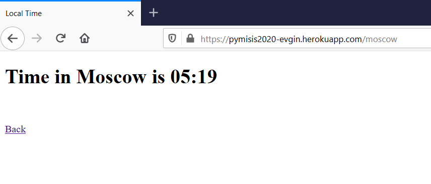

# Задание 2

В этот раз задание не разделяется на варианты, а общее для всех.

Если возникнут вопросы по заданию, их можно задать в телеграме или на следующем занятии.

Решения принимаются **до 28.03.2020 23:59**.

Отправлять свои решения в [форму](https://forms.gle/gA2axRn8say12DcG6). В форме надо указать свое ФИО, а так же две ссылки: одна на развернутое приложение, вторая на репозиторий с его кодом (подробнее в задании).

## Задание

Вам необходимо развернуть веб-приложение на Flask+Heroku. Имя приложения должно выглядеть следующим образом:

```
pymisis2020-NAME
```

где вместо `NAME` стоит ваша фамилия латинскими буквами. К примеру мое приложение называлось бы `pymisis2020-evgin`.

Чтобы создать приложение с определенным именем, достаточно приписать его после команды создания:

```
heroku create pymisis2020-evgin
```

Остальные детали создания приложения на Heroku вы можете найти в прошлом семинаре и [записях](../week_06_more_web/README.md#Recap-семинара) с него.

### Приложение **Local Time**



Ваше приложение должно представлять из себя веб-сервис с информацией о времени в разных городах (Москве, Берлине, Токио и Нью Йорке). Этот веб-сервис должен состоять из двух частей: обыкновенного браузерного приложения и Web API. Веб-приложение представляет из себя страницу со списком городов. Выбрав город, пользователь попадает на страницу, на которой указано текущее время в данном городе (с точностью до минут). API предоставляет аналогичный функционал: указывая в запросе город, пользователь получает информацию о текущем времени в нем в виде JSON документа.

В качестве "исходников" вам даются HTML файлы в папке `src` — весь фронтенд сделан за вас. Изменять эти файлы *не нужно*. Ваша задача заключается в том, чтобы написать приложение, используя фреймворк Flask и развернуть его на хостинге Heroku.

### Описание интерфейсов

#### Веб-приложение

* `/` — по этому пути приложение возвращает домашнюю страницу — файл `index.html` без изменений.

* `/newyork` — по этому пути приложение возвращает заполненный шаблон `time.html`. В шаблон должны быть подставлены имя города и текущее время. Имя города выводится с большими буквами, так, как оно указано на домашней странице (т.е. не "newyork", а "New York"). 

* `/moscow`, `/berlin`, `/tokyo` — аналогично.

* Для всех "неизвестных" городов (неправильных вводов), например `/abracadabra`, приложение должно возвращать страницу `not_found.html`.

#### API

Доступ к API производится с помощью GET запросов на специальный путь `/api`. В данный путь передается аргумент `city`, который определяет запрашиваемый город.

Пример:

```
/api?city=moscow
```

Приложение должно возвращать ответ в формате JSON, у которого три поля: `city`, `hour`, `minute`. Пример ответа сервера на запрос выше:

```
{
    "city": "Moscow",
    "hour": 12,
    "minute": 0
}
```

Поле `city` опять же содержить город с большими буквами в названии. Поля `hour` и `minute` содержат числа — число часов и минут времени в данный момент в указанном городе.

В случае если аргумент указан не правильно (такой город не найден) или город вообще не указан, приложение должно возвращать пустой JSON.

**Обратите внимание!** Ваше приложение не должно "умирать" при неправильном запросе. Иначе оно абсолютно уязвимо к тому, чтобы его уничтожить. Приложение должно в любом случае выдавать какой-то ответ и работать дальше.

### Советы и подсказки

Для разворачивания приложения на Heroku пользуйтесь пайплайном из последнего семинара.

#### Flask

Вам наверняка понадобятся следующие методы Flask-а:

* `render_template()` — рендерит предоставленный вам Jinja-шаблон в HTML страницу

* `jsonify()` — превращает различные объекты Питона (например, словари) в JSON, который можно отправлять в ответ

* `request` — объект, хранящий в себе данные запроса пользователя. Из него в частности можно достать аргументы запроса `request.args`.

Для работы со статичными файлами (HTML страницами) и шаблонами Flask-у нужна определенная структура проекта. Рядом с вашим основным файлом приложения должны располагаться директории `static` и `templates`, в которые необходимо поместить статические файлы и шаблоны соответственно. Метод `render_template()` по умолчанию ищет шаблоны именно в папке `templates`.

Вам также может пригодиться метод объекта приложения `send_static_file()`. Он также по умолчанию ищет файлы в папке `static`.

Таким образом, если ваше основное приложение находится в файле "my_app.py", то структура проекта должна выглядеть следующим образом:

```
pymisis2020-evgin/
├── templates/
│   ├── ...
│   ├── ...
├── static/
│   └── ...
└── my_app.py
```

#### Время

Для работы со временем можно использовать два модуля:

* `datetime` — встроенный модуль. Мы уже встречались с ним одном варианте прошлого задания. У его объекта `datetime` есть полезный метод `now()`, который принимает параметр `tz`.
* `pytz` — модуль, который надо дополнительно установить (не забудьте добавить его в зависимости `requirements.txt`, если будете использовать!). Он позволяет получать из строкового описания временной зоны объект `tzinfo` с помощью функции `timezone()`.

Для форматирования объекта `datetime` в нужный строковый вид можно использовать метод `strftime()`. Получить из этого объекта отдельно часы, минуты и т.д. тоже не сложно.

## Оценивание

Ваше приложение будет оцениваться как формально на работоспособность (выполняет нужный функционал, не падает при некорректных запросах), так и с точки зрения качества кода.

Не бойтесь выносить какой-то функционал приложения в отдельный модуль. Разделяйте логику своего приложения: отделяйте Flask-часть от простой вычислительной части.

В качестве результата работы, вам надо будет запустить на Heroku свое приложение и отправить в форму ссылки на приложение и на репозиторий, в который вы его загрузили (эти две ссылки появились у вас еще в самом начале, после команды `heroku create`).
